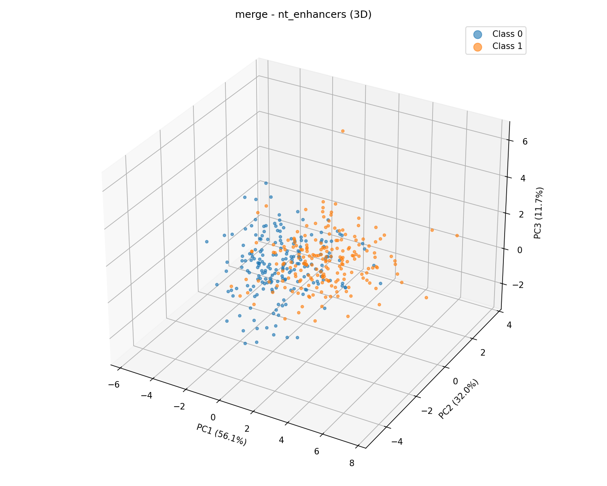

# MergeDNA+

Implementation of [MergeDNA](https://arxiv.org/abs/2511.14806) with additional compression variants. There are three variants: (1) The original version based on Token Merging (see below), and traditional and local attention transformer layers, (2) A U-Net convolutional attentional network used as the backbone of diffusion but without the diffusion training process, (3) the U-Net combined with denoising diffusion learning.

## Install

```bash
pip install torch local-attention tqdm numpy scikit-learn matplotlib 'datasets==2.21.0' biopython
```

## Models

### 1. Merge (ToMe)

Token merging via [bipartite soft matching](https://arxiv.org/abs/2210.09461). Local attention encoder merges r tokens per block using cosine similarity on keys. Source matrix S tracks merges for unmerging in decoder.

```bash
python train.py --model merge --dataset nt:enhancers --merge_r 4
```

### 2. Conv (U-Net)

Strided convolutions replace token merging. Learnable compression instead of similarity-based matching. Dilated convolutions for upsampling. U-Net skip connections.

```bash
python train.py --model conv --dataset nt:enhancers
```

### 3. Diffusion (DDPM + Conv U-Net)

Same Conv U-Net but trained with DDPM denoising. Embeds discrete tokens to continuous space, adds Gaussian noise at timestep t, predicts noise. Cosine or linear schedule.

```bash
python train_diffusion.py --dataset nt:enhancers --diffusion_steps 1000 --schedule cosine
```

## Pre-train + Classification Pipeline

Following the MergeDNA paper: pre-train the autoencoder on [Multi-Species Genomes](https://huggingface.co/datasets/InstaDeepAI/multi_species_genomes), freeze the encoder, then fine-tune a classification head on a downstream task.

```bash
# Step 1: Pre-train on multi-species genomes
python train.py --model merge --dataset multispecies --epochs 20

# Step 2: Fine-tune classifier (encoder frozen, only head trains)
python train_classifier.py \
  --checkpoint checkpoint_merge.pt \
  --encoder merge \
  --dataset nt:enhancers \
  --num_classes 2 \
  --epochs 10
```

Run all three variants automatically:

```bash
./run_experiment.sh
```

## Encoding

Nucleotides (A/T/C/G) are discrete categories with no ordinal relationship. Embedding + cross-entropy loss, not integer MSE.

## Datasets

```json
"dataset": "synthetic"                     // sine/cosine waves discretized to 4 bins
"dataset": "multispecies"                  // Multi-Species Genomes (pre-training)
"dataset": "nt:enhancers"                 // Nucleotide Transformer benchmark (18 tasks)
"dataset": "genomic:human_enhancers_cohn" // Genomic Benchmarks (8 tasks)
```

Generate synthetic: `python generate_data.py --train_seqs 1000 --seq_len 256`

## Config

All params in `config.json`, CLI overrides: `./run.sh --model conv --dim 128`

## Results



Output of running the ToMe merge method on the nt:enhancers dataset (i.e., pretrained on this set), we can see the network clusters the classes without labels fairly well. Important to note this is Linear PCA as well.

## Adaptive Pre-training (Section 3.4)

Full MergeDNA pre-training with all three losses and compression ratio sampling:

```bash
python train_adaptive.py --dataset multispecies --merge_r 4 --latent_merge_r 8 --amtm_k 32
```

**Compression ratio sampling** (Section 3.3): each forward pass samples target length L ~ Gaussian(N/2) clipped to [0.4N, 0.6N], preventing overfitting to a fixed compression rate.

Three forward passes per iteration:
1. **L_MTR** — full autoencoder reconstruction, compression ratio sampled from Gaussian
2. **L_latent_MTR** (x0.25) — global ToMe in latent encoder, local encoder frozen
3. **L_AMTM** — importance-weighted masking, loss only on high-information tokens
